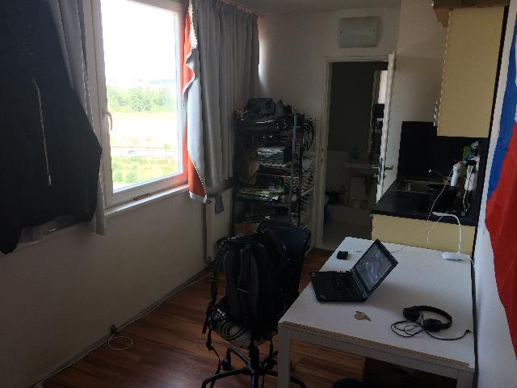
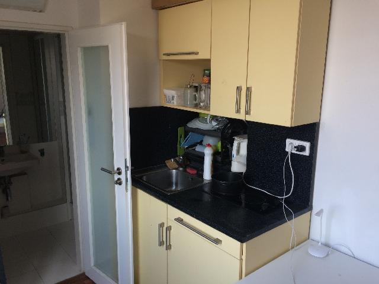

## {{page.title}} Home Rules

Welcome,

I'm glad to host you.

The house is easy to find. It's near to metro station __Invalidovna__, yellow line __B__. When you exit the station, turn right and you'll see the large white building called __Residence Expo__. Flat has number 818, 8th floor near elevator. Door has no number, flat number is on the mirror. The door with number is to chamber.

Address:

    Molakova 544/34
    flat no. 818
    180 00 Prague
    Czech Republic

Map: <http://www.openstreetmap.org/node/296801697>

 

I have prepaired for you sleeping bag, pad and towel, other is shared with me ;)

Feel free to pick some food and feel like home.

Please, lock the door, even when you are in, there is not a good door lock. I have 3 baskets, one for plastic and one for paper is in main room under window, one for normal trash is in the bathroom.

 

In case of any problem or if you have some question, contact me directly by phone __+420 773 452 376__ (iMessage, Telegram), email <ondrej@ondrejsika.com> or by [Facebook](https://facebook.com/sikaondrej2).

PS: I'll be pleased if you send me a postcard, when you'll be back at home :)

 

